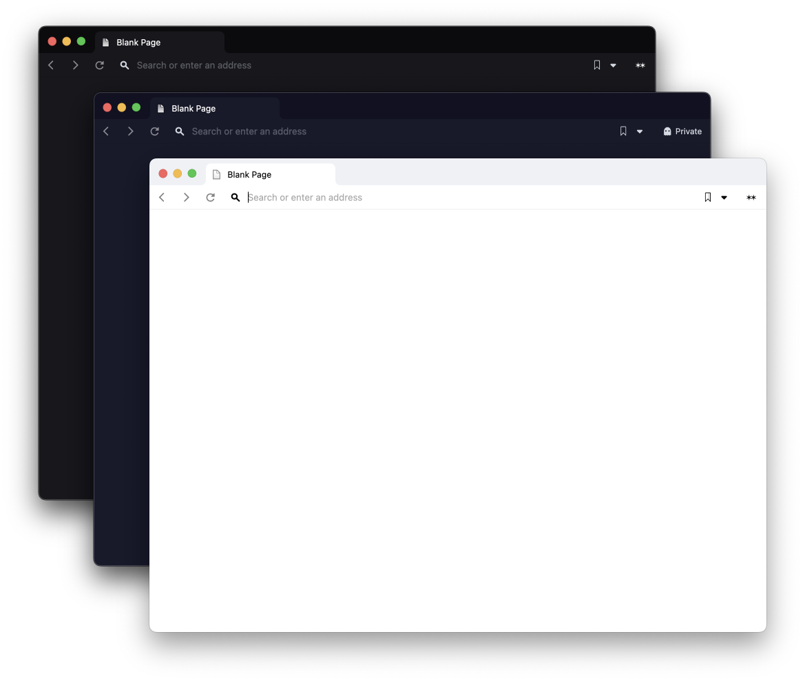

# Vivaldi overrides

> Some CSS to make Vivaldi on MacOS more Simon-friendly 🤗



## How to use

1. Go to `vivaldi://settings/themes/`, click `Open Theme…` and select the `light`, `dark` and `private` themes you find in this repo.

2. Find your Vivaldi directory (you can see this at `vivaldi://about`, for example).

3. Inside it, find the `Contents/Frameworks/Vivaldi Framework.framework/Versions/Current/Resources/vivaldi/style` folder – where `Current` should be a symlink to the version of Vivaldi you're using.

4. Clone this repo into said folder 👆🏻
    ```bash
    git clone git@github.com:s-rd/vivaldi-overrides .
    ```

5. Then, `cd ..` to find `browser.html` and add this to it:
    ```html
    <link rel="stylesheet" href="style/custom.css" />
    ```

6. Voilah. Enjoy a 12% increase in general life quality!

---

Made for MacOS 12.3. I have no idea if this works well elsewhere.
